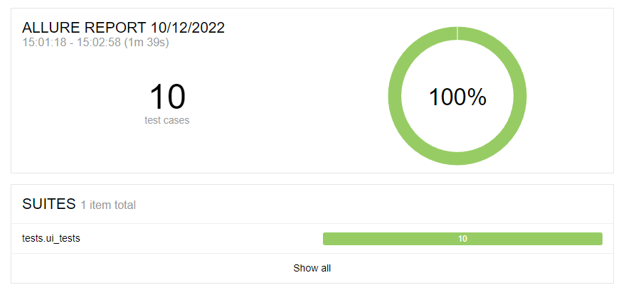
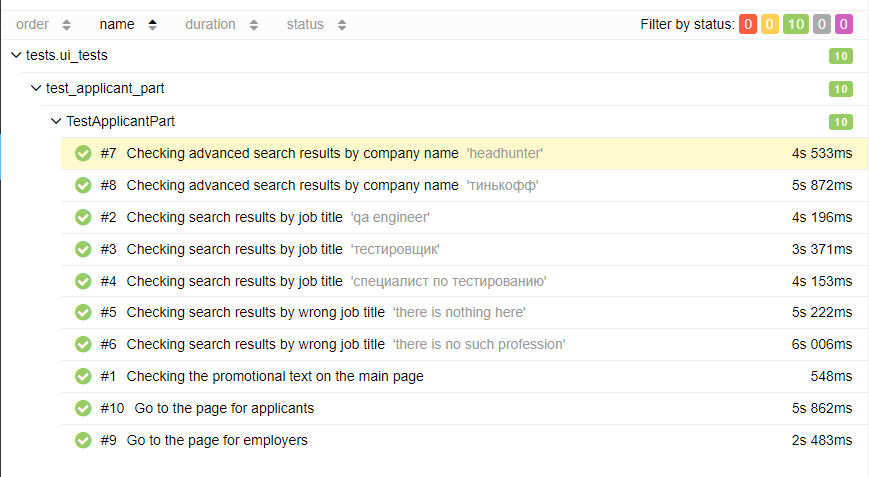
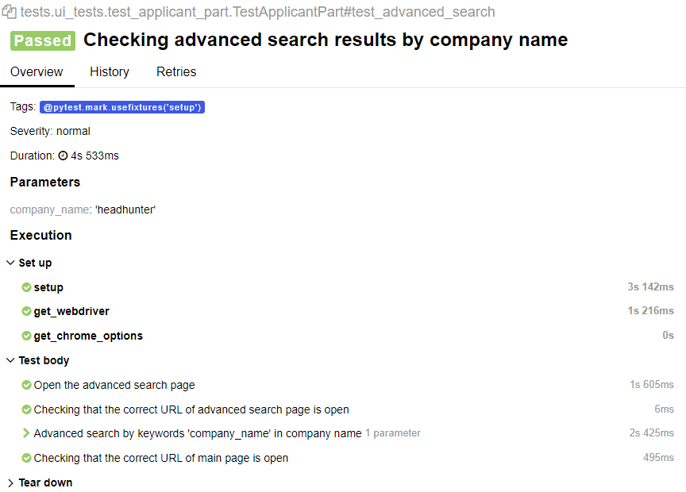
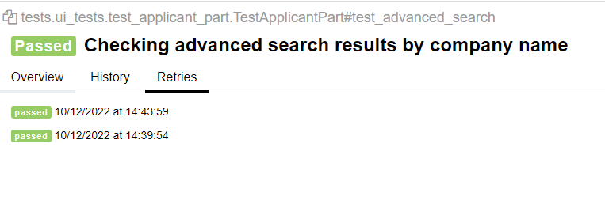

# Проект автотестов на [hh.ru](https://hh.ru/)


---

##  Реализованы проверки:
Ui:
- Проверка наличия корректного промо-текста на главной странице
- Проверка наличия результатов поиска по названию вакансии с параметрами
- Проверка результата поиска по некорректному названию вакансии с параметрами
- Проверка результата расширенного поиска по наличию ключевых слов в названии компании
- Проверка перехода на страницу для работодателей при нажатии кнопки в панели навигации
- Проверка перехода на страницу для соискателей при нажатии кнопки в панели навигации

##  Запуск проекта:
- Для запуска проектов локально:
```bash
pytest -s -v tests --alluredir=[path_to_report_dir]
```
- Для генерации Allure-репорта:
```bash
allure serve [path_to_report_dir]
```

##  Отчеты в Allure Report
- Графики

- Тестовые наборы

- Шаги воспроизведения

- История запуска теста
